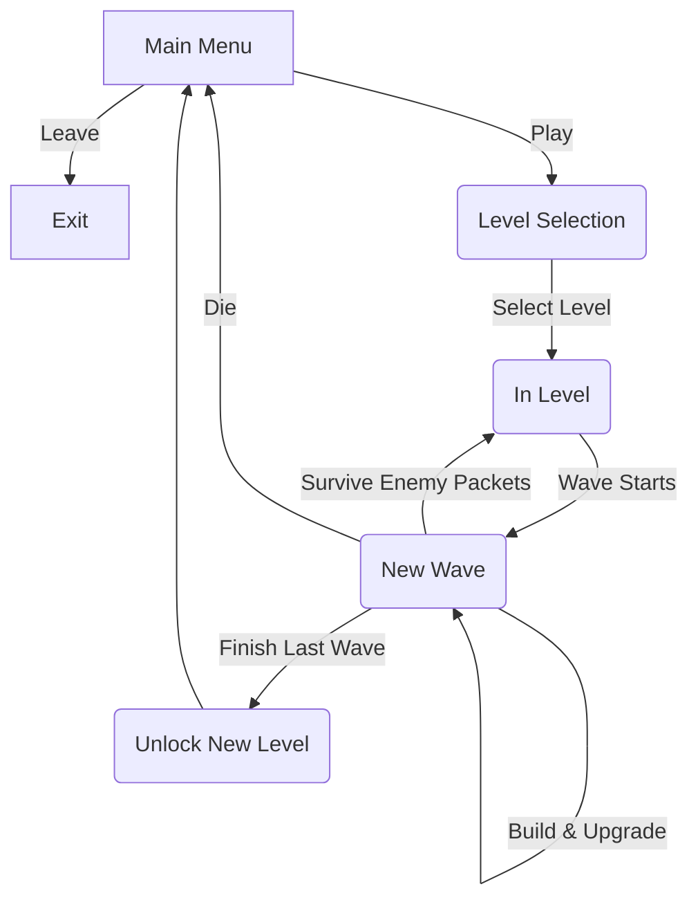
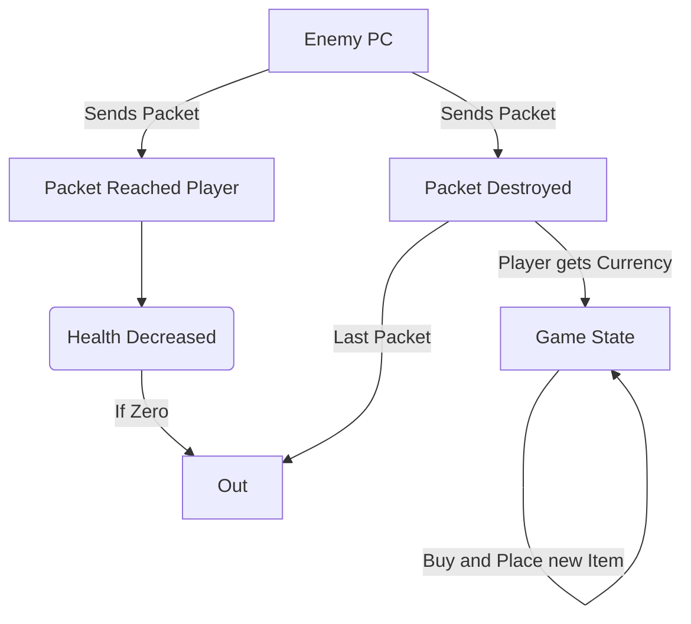

# PacketTerror - Proiect MDS
Experience the true horrors of networking!

[Cerintele Proiectului](https://app.box.com/notes/46831554845?s=6ly7x02gnt1i3yyjb5hec4no4narasnu)
## Echipa 
- [Vlad Popescu](https://github.com/PVDoriginal)
- [Matei Pescariu](https://github.com/PescaMA)
- [Mihai Duzi](https://github.com/mihaid-asm)

## Descriere
Un joc [Tower Defense](https://en.wikipedia.org/wiki/Tower_defense) cu o tema bazata pe [Cisco Packet Tracer](https://www.netacad.com/cisco-packet-tracer) in care jucatorii protejeaza marele intranet sovietic de atacuri inamice.

Proiectul este realizat in [Bevy](https://bevyengine.org/), un game engine scris in Rust bazat pe design patternul [ECS](https://www.umlboard.com/design-patterns/entity-component-system.html) (Entity Component System) ce prioritizeaza viteza de compilare si paralelizarea codului intr-un mediu non-OOP. 

## UML 
Macro Gameplay Loop: 

Micro Gameplay Loop: 

## Demo 

## User Stories
Puteti vedea [aici](https://github.com/users/PVDoriginal/projects/6) backlogul proiectului, format din user stories. 

## Teste Automate 
Avem un fisier de (testing)[https://github.com/PVDoriginal/PacketTerror/blob/main/src/testing.rs] unde putem rula teste automate.

